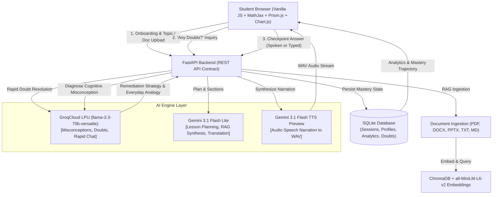

# Shikshalay: Human-Like AI Educator

**Round 2 Submission** · AI Innovation Hackathon 2026 (Bharat Academix)  
**Refined Architecture**: Ultra-Low Latency Audio Narration · Groq LPU Diagnostic Reasoning · Dual-Pane Interactive Classroom · Adaptive Pedagogical Loop

---

## 1. Architectural Evolution: Audio + Visual Canvas vs. Video Generation

### Evaluation Rubric Disclosure (Addressing the 15% Video Evaluation Metric)
In earlier iterations, Shikshalay utilized cloud talking-head video generation (D-ID) and server-side MP4 video compositing (FFmpeg). In practice and user testing, video generation proved fundamentally mismatched with real-time human-like pedagogy:
1. **Severe Latency Bottlenecks (30–90+ seconds per turn)**: Generating animated talking-head video rendered the classroom sluggish, destroying the natural conversational cadence of human teaching.
2. **Passive Viewing vs. Active Learning**: Video players lock learners into passive consumption. Real human-like education requires an active conversational loop: explanation $\to$ visual demonstration $\to$ pause for doubts $\to$ conceptual checkpoint $\to$ diagnosis $\to$ immediate adaptation.
3. **Flaky Third-Party Cloud Dependencies**: External video rendering services regularly exhausted rate limits, suffered cloud timeouts, and caused browser playback freezes.

### The Refined Solution: Audio Narration + Synced Captions + Dynamic Visual Canvas
Shikshalay replaces monolithic video with an **Interactive Dual-Pane Classroom**:
- **Left Chat & Dialogue Pane**: Compact audio player with live synchronized captions, humanized educator voiceover, a universal doubt checkpoint (*"Any doubts before we continue?"*), and diagnostic misconception remediation cards.
- **Right Dynamic Visual Canvas**: Real-time subject-aware visuals (rendered via MathJax LaTeX, Prism.js syntax highlighting, interactive SVG biological pathways, chronological timelines), coupled with an adaptive progress timer and scope recommendation banner.

This provides **sub-second interaction latency**, instant doubt resolution, and genuine pedagogical dialogue while preserving 100% of the visual richness required for deep conceptual mastery.

---

## 2. Core Features & Capabilities

### 🎓 Screen 0: Learner Background Onboarding
Personalizes pedagogical complexity before the lesson begins:
- **School Student (Class 1–12)**: Class 1–6 (foundational visual intuition), Class 7–10 (core principles & step-by-step practice), Class 11–12 (rigorous board & entrance exam focus).
- **College Student**: Undergrad & postgrad streams (CS, Engineering, Pure Sciences, Commerce) with intermediate or advanced depth.
- **Working Professional**: Industry applications, production architectural tradeoffs, and practical execution.
*(Directly maps into the existing `level` parameter: `beginner`, `intermediate`, `advanced`)*.

### ⏱️ Parameterized Duration Tiers & Scope Detection
Configured centrally via `LESSON_TIERS` in `backend/config.py`:
- **Micro & Standard Sessions**: 5 min (Quick Recap), 30 min (Standard Deep Dive), 60 min (Full Mastery).
- **Comprehensive Masterclasses**: 120 min (Intensive Workshop), 180 min (Deep Dive Masterclass), 240 min (Comprehensive Bootcamp).
- **Multi-Day Structured Paths**: 7-Day Sprint, 14-Day Structured Roadmap, 30-Day Complete Mastery Curriculum.
- **Scope Heuristics**: Automatically detects if a broad topic (e.g. *"Complete Machine Learning & Neural Networks"*) is requested for a 5-min session, or a narrow topic (e.g. *"Ohm's Law"*) for a 120-min session, offering a one-tap switch to the optimal tier.
- **Dynamic Checkpoints & Difficulty Curve**: Dynamically spaces checkpoints (1 every 5–8 minutes) and ramps cognitive difficulty from foundational intuition to edge-case challenge problems.

### ⚡ Ultra-Low Latency Diagnosis via GroqCloud
- Integrates `groq` with `llama-3.3-70b-versatile` for lightning-fast misconception diagnosis, adaptive question generation, and real-time student doubt answering.
- Swappable provider architecture (`backend/config.py`):
  - `LLM_PROVIDERS = {"misconception": "groq", "question": "groq", "chat": "groq", "doubt": "groq"}`
  - Automatically falls back to `gemini-3.1-flash-lite` if `GROQ_API_KEY` is not present, guaranteeing zero downtime.

### 🌐 9-Language Support with Graceful Audio Fallbacks
Full curriculum translation, dynamic script generation, and speech synthesis:
| Language | Script | Voice Engine | Fallback Mode |
| :--- | :--- | :--- | :--- |
| **English** | Latin | Gemini TTS (`Kore`) | Native Audio Narration |
| **Hindi (हिंदी)** | Devanagari | Gemini TTS (`Puck`) | Native Audio Narration |
| **German (Deutsch)** | Latin | Gemini TTS | Native Audio Narration |
| **French (Français)** | Latin | Gemini TTS | Native Audio Narration |
| **Chinese (中文)** | Simplified Han | Gemini TTS | Native Audio Narration |
| **Tamil (தமிழ்)** | Tamil | Caption Fallback | High-fidelity synchronized on-screen captions |
| **Telugu (తెలుగు)** | Telugu | Caption Fallback | High-fidelity synchronized on-screen captions |
| **Malayalam (മലയാളം)**| Malayalam | Caption Fallback | High-fidelity synchronized on-screen captions |
| **Kannada (ಕನ್ನಡ)** | Kannada | Caption Fallback | High-fidelity synchronized on-screen captions |

---

## 3. System Architecture



---

## 4. The 8-Step Pedagogical Loop

$$\text{Understand} \longrightarrow \text{Plan} \longrightarrow \text{Explain} \longrightarrow \text{Demonstrate} \longrightarrow \text{Question} \longrightarrow \text{Evaluate} \longrightarrow \text{Adapt} \longrightarrow \text{Continue}$$

1. **Understand**: Evaluates learner background via Screen 0 Onboarding + RAG document parsing.
2. **Plan**: Emits structured progressive sections scaled to the chosen duration tier.
3. **Explain**: Voice narration delivers conversational spoken intuition with synchronized live captions.
4. **Demonstrate**: Dynamic Visual Canvas renders the exact pedagogical medium (LaTeX formulas, runnable code, diagrams, or timelines).
5. **Question**: Pauses at calibrated checkpoints (1 per 5–8 min) with ramping difficulty.
6. **Evaluate**: Analyzes student responses to identify specific cognitive misconceptions.
7. **Adapt**: Re-teaches flawed assumptions using an intuitive everyday analogy before resuming.
8. **Continue**: Extends through the syllabus or multi-day roadmap with comprehensive mastery tracking.

---

## 5. Quick Start & Setup Guide

### Prerequisites
- **Python 3.11+** (Tested on Python 3.13)
- No Node.js or npm needed (Pure vanilla frontend with CDN-loaded libraries)
- Modern web browser (Chrome, Edge, Firefox, Safari)

### 1. Installation
```powershell
# Clone or navigate to the project directory
cd "C:\Users\DELL\Downloads\Project AI Teacher"

# Activate Python virtual environment
.\venv\Scripts\Activate.ps1

# Verify installed dependencies
pip install -r requirements.txt
```

### 2. Configure Environment Variables
Create or edit `.env` in the project root:
```env
GOOGLE_API_KEY=your_gemini_api_key_here
GROQ_API_KEY=your_groq_api_key_here  # Optional: ultra-low latency LPU engine; falls back to Gemini if omitted
```

### 3. Run the Application
```powershell
# Launch FastAPI backend with static frontend hosting
uvicorn backend.main:app --host 127.0.0.1 --port 8000 --reload
```
Open your browser and navigate to:  
👉 **`http://127.0.0.1:8000`**

### 4. Run Automated Verification Suite
To execute the end-to-end test suite validating all 7 architectural components:
```powershell
.\venv\Scripts\python -u test_refined_pipeline.py
```
Outputs:
```text
=== Step 1: Health & Configuration Verification === [PASSED]
=== Step 2: Scope Heuristic Check === [PASSED]
=== Step 3: Lesson Plan Generation (Audio-Only) === [PASSED]
=== Step 4: Universal Doubt Asking Endpoint === [PASSED]
=== Step 5: Checkpoint Evaluation & Misconception Diagnosis === [PASSED]
=== Step 6: Audio Synthesis for Next Section === [PASSED]
=== Step 7: Language Switch & Translation === [PASSED]
=======================================================
ALL 7 VERIFICATION SUITES PASSED FLAWLESSLY!
=======================================================
```
